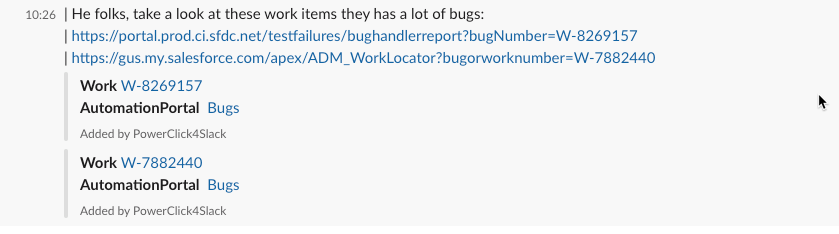
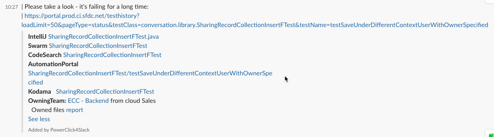
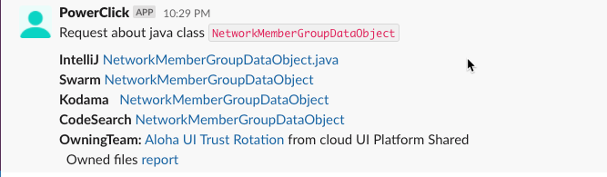

PowerClick for Slack 
=================

This extension is adding support of PowerClick for Salesforce into Slack.
It allows to catch the URL mentioned in the channel leading to some Salesforce systems and provide additional references to other systems.

List of supported systems:
-------------------
* [Automation Portal](https://portal.prod.ci.sfdc.net/)
* [SWARM](https://swarm.soma.salesforce.com)
* [CodeSearch](https://codesearch.data.sfdc.net/source/)
* [KODAMA](https://kodama.eng.sfdc.net/)
* [IntelliJ IDE](https://www.jetbrains.com/idea/) ( [GUS Support group](https://gus.lightning.force.com/lightning/r/CollaborationGroup/0F9B000000000GnKAI/view) )

See the demo video [HERE](https://spuliaiev-sfdc.github.io/powerclick4Slack/docs/Hackday-Slack-2021-01-14_22-26-17.mp4)

Features
-------------------
Tracking the links to supported systems and providing links to relevant systems.

* Work Item mentioned. Enhanced with link to Work Item in GUS and list of related Test Failures in AutomationPortal:
    

* Class files references, Test files references. Enhanced with links to:
  * Swarm for change history
  * CodeSearch for file content
  * AutomationPortal for test method history (If method is provided and starting with `test`)
  * Kodama to get information about ownership  
  * Owning team information and link to report with other files owned by team
  * IntelliJ IDE link to open in editor (If [PowerClick IntelliJ plugin](https://git.soma.salesforce.com/pages/intellij/powerclick/#intelliJ_menu) is [installed](http://localhost:63342/api/installPlugin?action=install&pluginId=com.salesforce.powerclick))  
  

Additionally, new command introduced to search for java classes, which provides similar features: 

`/javaclass NetworkMemberGroupDataObject`

Plans
-------------------
* Add fetching information from GUS to provide also meaninful information for GUS URLs like 
`https://gus.lightning.force.com/lightning/r/ADM_Work__c/a07B0000008Wc38IAC/view`
* Fetching information from SWARM about reviews and changes
* Detection off the WorkItems in messages (by format like `W-<number>` and `SA-<number>`)

References:
-------------------

* **PowerClick for Browsers** [See how to use](https://git.soma.salesforce.com/pages/intellij/powerclick/#browser_menu)
  
  Drag the bookmarklet from the web site to your browser bookmarks bar to use it for different salesforce web tools!

* **PowerClick for IntelliJ** [See how to use](https://git.soma.salesforce.com/pages/intellij/powerclick/#intelliJ_menu)
  
  Click on this link to automatically install it into the IntelliJ IDE! [Install](http://localhost:63342/api/installPlugin?action=install&pluginId=com.salesforce.powerclick)

* **PowerClick for Slack** [Git Repository](https://github.com/spuliaiev-sfdc/powerclick4Slack) [Site] (https://spuliaiev-sfdc.github.io/powerclick4Slack/)

Debug in  InteliiJ
-------------------
Add new Node Application with the following parameters:
* Node interpreter (Add as Local):
  `node_modules/.bin/nodemon`
* Node parameters:
  
  `--inspect-brk`
* Javascript:
  
  `app.js`
  
And RUN this configuration.

Add another configuration:
* type:
  
    `Attach to NodeJS/Chrome`
* Reconnect automatically:
  
    `Yes`

And Run it connect with debug support - it will reconnect when nodemon restarts to accommodate your files changes!

## How to setup Slack APP

### Socket Mode
  Go to 'Socket Mode' and enable the Socket Mode

### Basic Information
1.  Go to 'Basic Information' and save the value of Signing Secret from section Basic Information :
  `Signing Secret`
  to put into variable **SLACK_SIGNING_SECRET**
    

2. Generate 'App-Level Tokens' with some name, like 'PowerClickToken' and Scope=connections:write
   Save it's value to put into variable **SLACK_SOCKET_APP_TOKEN**

   
3. Set in the 'Display Information' values:
  * **App name** = PowerClick4Slack
  * **Short description** = Salesforce PowerClick for Slack
  * **Background color** = #3855ab

### Slash Commands configuration 
  Go to 'Slash Commands' and configure the following Commands:
1. **/work**
  * Description: Renders URL to open Work Item in GUS
  * Hint: W-1234554   
2. **/entity**
  * Description: Find entity information
  * Hint: Account   
3. **/javaclass**
  * Description: Identifies the java class 
  * Hint: Account.getSfdcAccountElement:112

### Home Tab Configuration
1. Go to 'App Home Section' and enable Home Tab

   
2. Set the 'App Display Name' to
   `PowerClick4Slack`
   

3. Set the 'Default username' to
   `PowerClick`

### Interactivity & Shortcuts configuration
  Go to 'Interactivity & Shortcuts' and enable it  

### OAuth & Permissions configuration
  Go to 'OAuth & Permissions' and add the following scopes:
* app_mentions:read
* chat:write
* commands
* im:read
* im:write
* links:read
* links:write

### Event Subscriptions configuration
1.  Go to 'Event Subscriptions' and enable it
    

2. Subscribe bot for the following events:
* app_home_opened
* link_shared

3. Add the following domains for section 'App unfurl domains'
* swarm.soma.salesforce.com
* codesearch.data.sfdc.net
* sfdc.net
* gus.my.salesforce.com
* gus.lightning.force.com

### Install App into workspace
  Save the value of 
  `Bot User OAuth Access Token`
  to put into variable **SLACK_BOT_TOKEN**

### Use your saved credentials for app
Copy the saved values into the execution configuration for your NodeJS app:
* **SLACK_SIGNING_SECRET**
* **SLACK_SOCKET_APP_TOKEN**
* **SLACK_BOT_TOKEN**
